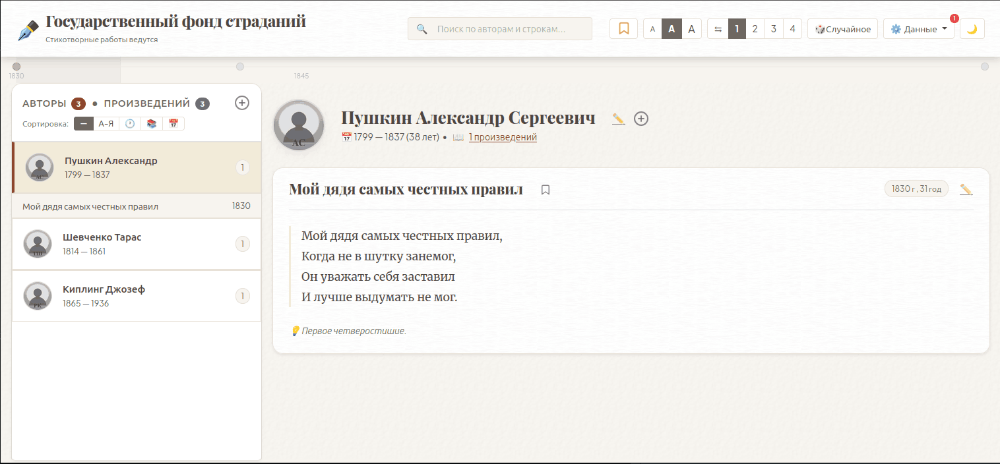

# Поэтическая Полка

Клиентское веб-приложение для хранения, чтения и организации поэтических произведений. Работает полностью в браузере без сервера — все данные хранятся в `localStorage`.

> **Проект сугубо личный.** Написан в основном AI-агентами, на скорую руку и для собственного пользования. Код не претендует на образцовость и не может служить примером работы автора.



## Возможности

### Управление данными
- **Управление авторами** — добавление, редактирование, удаление. Поддержка фото (файл, URL, буфер обмена), годов жизни, различных порядков ФИО
- **Управление произведениями** — текст или HTML-разметка, год написания, заметки, внешние ссылки, переводы
- **Поиск дубликатов** — автоматическое обнаружение дублирующихся авторов и произведений

### Чтение и навигация
- **Временная шкала** — визуальная хронологическая лента произведений с возможностью навигации
- **Поиск** — по авторам и содержимому произведений, с автоматической конвертацией английской раскладки в русскую
- **Закладки** — для быстрого доступа к избранным произведениям
- **Случайное произведение** — переход к случайному произведению из коллекции
- **Подсветка строк** — при клике на строку произведения

### Экспорт и импорт
- **Экспорт/Импорт JSON** — сохранение и загрузка библиотеки в формате JSON
- **Экспорт в EPUB** — генерация электронной книги с выбором авторов (выбор сохраняется в localStorage)

### Настройки интерфейса
- **Темы оформления** — светлая и тёмная
- **Настройки чтения** — размер шрифта (3 варианта), количество колонок (1–4, с автоподбором по длине текста)
- **Сортировка авторов** — по алфавиту, дате рождения, количеству произведений, последнему просмотру
- **Сортировка произведений** — по дате, названию, году написания
- **Изменение ширины сайдбара** — перетаскивание границы
- **Счётчик изменений** — отслеживание несохранённых изменений

### Дополнительно
- **MCP-сервер** — для работы AI-агентов с библиотекой (JSON-RPC)
- **Случайные заголовки** — автоматическая смена поэтических заголовков и подзаголовков
- **YouTube миниатюры** — автоматическое отображение превью для ссылок на YouTube

## Технологии

- Vanilla JavaScript (ES6+ классы, без сборщика)
- [jQuery 4](https://jquery.com/)
- [Bootstrap 5.3](https://getbootstrap.com/)
- [JSZip](https://stuk.github.io/jszip/) + [FileSaver.js](https://github.com/nicksav/FileSaver.js) — для генерации EPUB (только при экспорте)
- Шрифты: Merriweather, Playfair Display, Plus Jakarta Sans (локальные woff2)

## Структура проекта

```
index.html              — единственная HTML-страница приложения
server.php              — MCP-сервер для работы AI-агентов с библиотекой
mcp.example.json        — образец конфигурации MCP-сервера
tests/                  — тесты (node --test), см. «Тесты»
assets/
  storage-keys.js       — ключи localStorage и значения настроек
  app.js                — главный класс PoemApp (контроллер)
  store.js              — хранилище данных PoemStore (модель)
  ui.js                 — класс PoemUI (представление)
  timebar.js            — компонент временной шкалы TimelineBar
  utilities.js          — общие утилиты (изображения, строки, раскладка)
  DuplicateDetector.js  — логика поиска дубликатов
  styles.css            — основные стили
  theme-dark.css        — тёмная тема
  fonts/                — локальные шрифты (woff2)
```

## Запуск

Проект не требует сборки и установки зависимостей. Откройте `index.html` в браузере или запустите через любой локальный HTTP-сервер:

```bash
npx serve .
```

Все зависимости (jQuery, Bootstrap, JSZip, FileSaver) уже лежат в папке `vendor/` и подключаются оттуда — `npm install` для запуска не нужен.

`node_modules` и `package.json` остаются только для разработки: через них можно обновить версии библиотек, после чего скопировать новые файлы в `vendor/`.

## Работа без сети

Приложение полностью автономно: ни один ресурс не подгружается извне.

- Скрипты, стили, шрифты и favicon лежат в репозитории
- JSZip и FileSaver подключаются из `node_modules/`, а не с CDN
- Единственное обращение в сеть — необязательное превью видео YouTube при наведении на ссылку. Без сети оно просто не появляется, ссылка продолжает работать

Работать можно и вообще без установки зависимостей: скопируйте `bootstrap` и `jquery` из `node_modules` куда угодно — приложению нужны только эти два файла, EPUB-экспорт без JSZip работать не будет.

## Тесты

Логика, которую нельзя проверить глазами (распознавание переводов, поиск
дубликатов, строковые утилиты), покрыта тестами на встроенном раннере Node:

```bash
npm test
```

Тесты читают реальные файлы из `assets/` и выполняют их в `vm`-контексте,
поэтому проверяется именно тот код, который работает в браузере. Новым
тестам достаточно Node 18+ — зависимости ставить не нужно.

## Данные

Данные хранятся в `localStorage` браузера под ключом `poetic_shelf_data`. При первом запуске загружается `data.json` (если есть). Рекомендуется регулярно экспортировать данные через меню «Данные > Сохранить...».

## MCP-сервер

`server.php` реализует протокол [Model Context Protocol](https://modelcontextprotocol.io) (JSON-RPC по STDIN/STDOUT) и даёт AI-агентам доступ к библиотеке: список авторов, полнотекстовый поиск, чтение и добавление произведений.

Сервер работает с самым свежим файлом резервной копии `poetic_shelf_backup_*.json`. Образец подключения — в `mcp.example.json`.

## Лицензия

[MIT](LICENSE)

